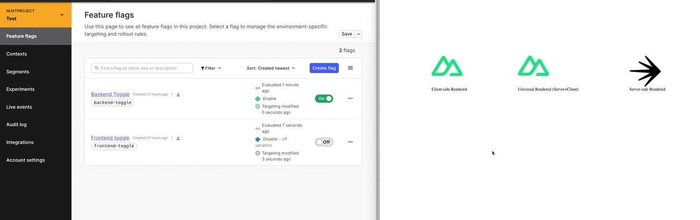

# LaunchDarkly Nuxt3 Sample application

This is a sample Nuxt3 app using LaunchDarkly Vue and NodeJS SDKs.

Created with Nuxt3 starter script, look at the [Nuxt 3 documentation](https://nuxt.com/docs/getting-started/introduction) to learn more.


## Demo



## Requirements
* [LaunchDarkly Account](https://launchdarkly.com/start-trial/)
* [ LaunchDarkly SDK key and Client Side ID](https://docs.launchdarkly.com/sdk/concepts/client-side-server-side?q=sdk%20key)
* NodeJS >= 16.x
* [Nuxt3](https://nuxt.com/docs/getting-started/introduction)
  
## Setup

1. Make sure to install the dependencies:

```bash
# yarn
yarn install

# npm
npm install
```
2. Create `.env` file and copy and paste the env variables below with your project's **client-side ID** and **SDK key**.
```
CLIENT_SIDE_ID=< LaunchDarkly client side ID>
SERVER_SIDE_SDK_KEY=<LaunchDarkly SDK key>

```


3. Create the following feature flags:
   * frontend-toggle
   * backend-toggle
  
  

## Development Server

Start the development server on `http://localhost:3000`

```bash
npm run dev
```

## Production

Build the application for production:

```bash
npm run build
```

Locally preview production build:

```bash
npm run preview
```

Check out the [deployment documentation](https://nuxt.com/docs/getting-started/deployment) for more information.
